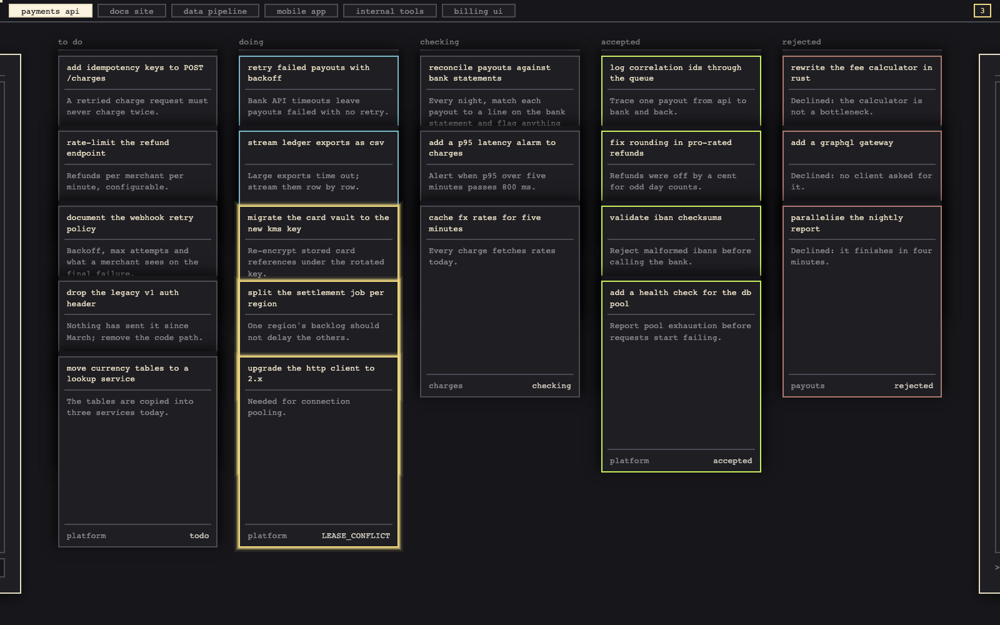
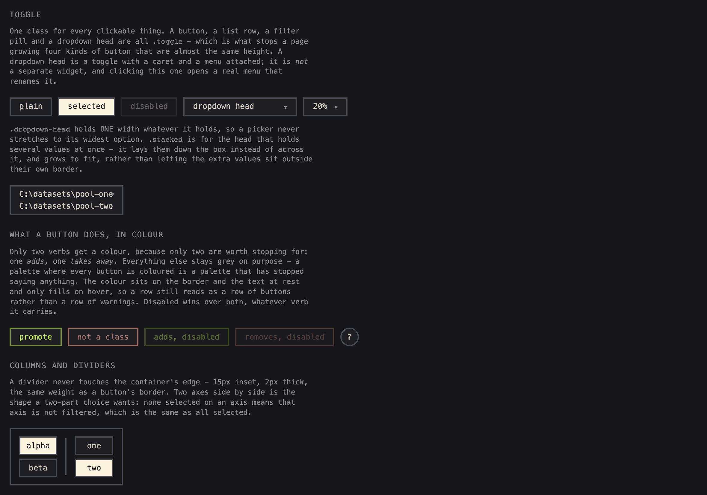
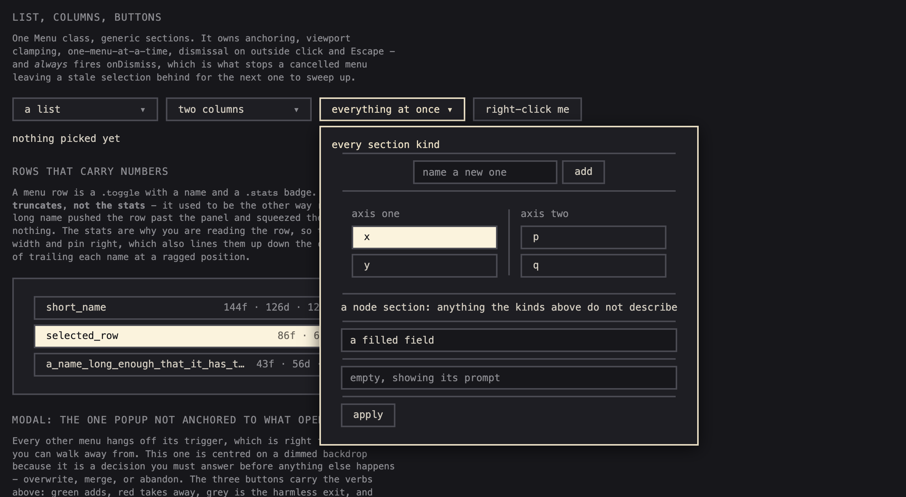
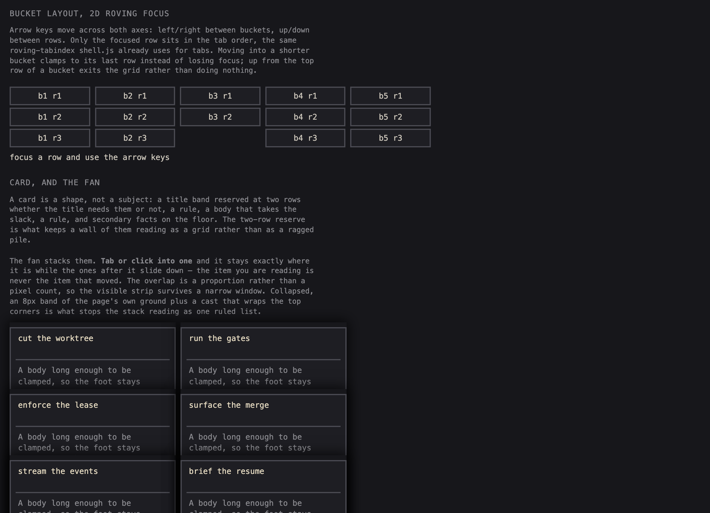
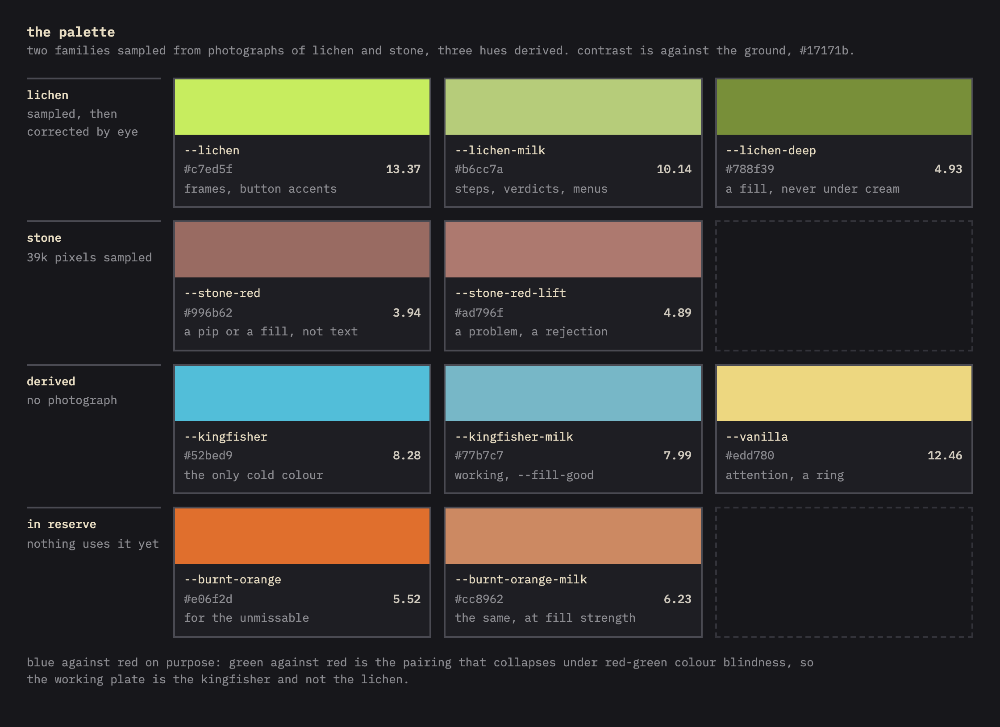

# smortui

**The shared web interface for a family of local tools.** One stylesheet and a handful of plain
scripts - menus, a tab shell, a keyboard-first board layout, cards, drawers, selection, pan and
zoom - that a small Python server hands out so every tool looks and behaves like one product.

**No build step, no framework, no npm.** A `<link>` and a few `<script>` tags.



<sub>[smortboard](https://github.com/BalthazarFitzpatrick/smortboard) is built from these pieces:
buckets, cards and the fan, drawers, expanders, menus, the focus marker, the palette.</sub>

---

## Start

```bash
git clone https://github.com/BalthazarFitzpatrick/smortui && cd smortui
uv sync
uv run python demo/serve.py --port 8770     # every component on one page
```

In a tool, pin it by commit (the repo is `smortui`; the Python package inside is `ui_base`):

```toml
dependencies = ["ui_base @ git+https://github.com/BalthazarFitzpatrick/smortui.git@<commit sha>"]
```

Serve its assets from your request handler, then load them in the page. **Order matters**:
`base.css` first so your own stylesheet can override it, and `shell.js` before the script that
calls `initShell`.

```python
from ui_base import read_asset, UiBaseError

# a path like /ui/menu.js -> "menu.js"; refuses anything outside the assets
try:
    body = read_asset(name)
except UiBaseError:
    ...  # 404
```

```html
<link rel="stylesheet" href="/ui/base.css">
<link rel="stylesheet" href="/ui/your-layout.css">
<script src="/ui/menu.js"></script>
<script src="/ui/shell.js"></script>
```

`read_asset` resolves the path and checks it is still inside the asset folder rather than
string-matching on `..` - the only reliable test, and the classic hole in a route that concatenates
a caller's name onto a directory. `demo/serve.py` is exactly that wiring, so if the demo works, the
instructions above are right.

## What is in it

| file | gives you |
|---|---|
| `base.css` | the tokens and every primitive: `.toggle`, dividers, columns, panels, rows, cards, the fan, badges, hazard stripes |
| `menu.js` | `Menu`, `listMenu`, `renderTree`, `makeSlider`, `makePanZoom` |
| `shell.js` | `initShell`, `activateTab` - tabs, keyboard nav, remembering where you were |
| `buckets.js` | `makeBuckets` - side-by-side lists with 2D roving focus |
| `expand.js` | `makeExpander` - a strip that grows into a centred panel and back |
| `drawer.js` | `makeDrawer` - a sliver at a screen edge that opens into its half |
| `indicate.js` | `indicateBadge`, `indicateFocus` - a count badge and a gliding focus marker |
| `select.js` | `makeSelection` - click, cmd+click, shift+drag, right-click over a grid |
| `align.js` | `makeAligner` - drag a crop under a fixed guide, `wasd` nudging, live preview |

### Controls



**One clickable class**, `.toggle`, for buttons, list rows, filter pills and dropdown heads. **Only
two verbs get a colour**: one that adds and one that takes away. Everything else stays grey, because
a palette where every button is coloured has stopped saying anything. The colour sits on the border
at rest and only fills on hover.

### Menus



One class for every popup - dropdowns, right-click menus, pickers - built from generic sections, so
a new menu is a data structure rather than new code.

```js
new Menu({
  title: 'open a thing',
  columns: false,              // true lays sections side by side, split by a vertical rule
  onDismiss: () => {},         // ALWAYS fires - this is what stops a stale selection surviving
  sections: [...],
}).openAt(triggerElement);     // or .openAt({x, y}) for a right-click
```

| section kind | for |
|---|---|
| `list` | rows with optional `stats`, `on`, `disabled`, `state`, and a trailing `action` |
| `columns` | two or more axes side by side, each with its own `label`, `items`, `empty`, `multi`, `onPick` |
| `add` | a "+ new" row: a text field and a button |
| `field` | a single text input |
| `buttons` | a footer row of actions |
| `node` | content you built yourself, placed and styled by the panel |

The class owns anchoring, viewport clamping, one menu at a time, dismissal on outside click and
Escape, and arrow/Enter navigation. An item's `state` flags become classes on its row. `persistent:
true` is for a menu you work in rather than pick from. `menu.refresh(sections)` rebuilds an open menu
in place, keeping its position and any class you added after opening. `multi` defaults to true in
`columns` and false in a `list`.

### Board primitives



- **Buckets** (`makeBuckets`): arrow keys move across both axes. Only the focused row sits in the tab
  order. Moving into a shorter bucket clamps to its last row; up from the top exits the grid.
- **Card and fan**: a card is a shape, not a subject - a title band reserved at two rows, a rule, a
  body, a rule, a foot. The fan stacks them; the one you focus stays put and the ones after it slide
  down, so the item you are reading is never the one that moved.
- **Expander** (`makeExpander`): a strip grows into a centred panel and shrinks back, reading its own
  rect as the start of the animation. It owns no persistence.
- **Drawer** (`makeDrawer`): a sliver parked at a screen edge that opens into the middle of its half.
- **Badge and focus marker** (`indicate.js`): a count badge hidden at zero, and one marker element
  that glides between focus targets rather than a ring drawn by each.
- **Hazard stripes**: a placeholder for content that is not there yet, so empty reads as "nothing
  here on purpose" rather than "failed to load".

### Selection

`makeSelection` is click, cmd/ctrl+click, shift+drag and right-click over a grid. Plain click picks
rather than toggling a destructive flag; shift+drag draws a net on screen rather than a range through
the rendered order, because the mismatches you can see sit together on screen.

### Pan, zoom, slider, aligner

`makePanZoom` zooms about the pointer and `reset` fits and centres. `makeSlider` is an axis with ticks
and an optional distribution drawn over it, so "no results" and "your cut sits above every value"
stop looking identical. `makeAligner` is for last-pixel crop work and owns no persistence.

## The visual language

Six rules carry the whole look. They are in `base.css`'s header too, where someone about to
override something will be looking.

1. **One row height, app-wide** (`--row-height`). Every row and button is that tall.
2. **One clickable class**, `.toggle`.
3. **Dividers never touch the container edge.** 15px inset, 2px thick - the weight of a button
   border, because a 1px rule beside 2px buttons reads as a different system.
4. **Selection is bright, rejection is muted.** Rejecting is a decision, not an achievement.
5. **Text stays selectable.** `user-select: none` also makes every name and readout uncopyable.
6. **Monospace throughout**, because these tools show filenames, counts and coordinates.

**One font size, everywhere** (`--font-size`); emphasis is carried by colour and by the row a thing
sits in. A test fails the build if a `font-size` is set anywhere but the token. Four more tokens
carry the vertical rhythm: `--gap` between rows in a panel, `--inset` a panel's top and bottom,
`--inset-x` its sides, and `--row-height`. `.h-divider` adds no space of its own - the parent's
`gap` spaces it like any other child.

Override by redefining the tokens, not by fighting the rules.

## The palette



Neutrals do the work: a charcoal ground, a cream for emphasis, and greys between. The hues are kept
few on purpose, because a colour that appears everywhere stops meaning anything. Two families were
sampled from photographs of lichen and stone - each the median of its photo filtered to that hue
band above 22% saturation, so it is the lichen and the stone themselves rather than their blend with
grey. The rest are derived.

**The lichen is the interesting one, because sampling got it wrong.** The photo's median is
`#bcbf88`, faithful to the *photograph* rather than to the lichen: overcast light and phone
processing left no pixel both vibrant and pale. Balthazar Fitzpatrick, who was standing there:
*"much more vibrant, like a pale lime, the photos dont do it justice."* Saturation was raised to 0.60
and the hue nudged 62° → 76° by eye against the real thing. **Measurement fixed the family; only the
person who saw it could fix the rest.**

**Lichen milk** is the same lichen at the strength kingfisher milk already has: pale enough to mark a
finished step, a verdict or a menu accent without shouting over the words. Full lichen stays for
frames and button accents.

**The working plate is cold on purpose.** Green against red is the pairing that collapses under
red-green colour blindness, which is most colour blindness there is, so `--fill-good` points at the
kingfisher milk. `--vanilla` belongs to no photograph: attention needed a colour of its own, and it
was chosen by maximising the smaller of its two separations, from cream and from the lichen.

`--status-good`, `--status-warn`, `--fill-*` and `--attention` point at these, so a repalette moves a
pointer and the record of where each colour came from stays. **Nothing uses `--attention` by
default** - an attention colour that is always on stops being one. The demo's colour tab shows every
token with its contrast, and a test fails if a hue arrives without being named in it.

## Why it is a project rather than a copy

Every behaviour here was paid for by a real failure in a tool first:

- a popup with no dismiss handler left a stale selection alive, which the next right-click swept up
  and applied - so `Menu` always fires `onDismiss`
- a shared dismiss handler hardcoded its trigger ids, so every new menu closed on its own opening
  click until it was added
- `reset view` set the scale back and left the pan alone - so reset centres too
- with shift held, a browser sends the wheel as `deltaX`, so shift+scroll only ever zoomed out

Copying the files copies the code and loses the reasons. The reasons are most of the value, so they
live in the comments and travel with it. Used by
[smortboard](https://github.com/BalthazarFitzpatrick/smortboard) and a screenshot review tool, both
consuming it as a package.

## Development

```bash
uv run pytest                                # asset serving, the palette guard, the font-size rule
for f in tests/js/*.mjs; do node "$f"; done  # the scripts, against a stub DOM
uv run ruff check .
```

## Licence

MIT - see [LICENSE](LICENSE).
